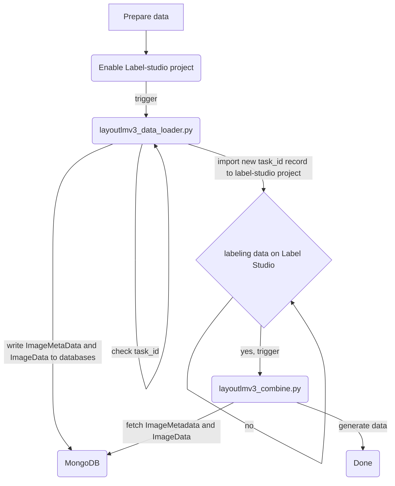
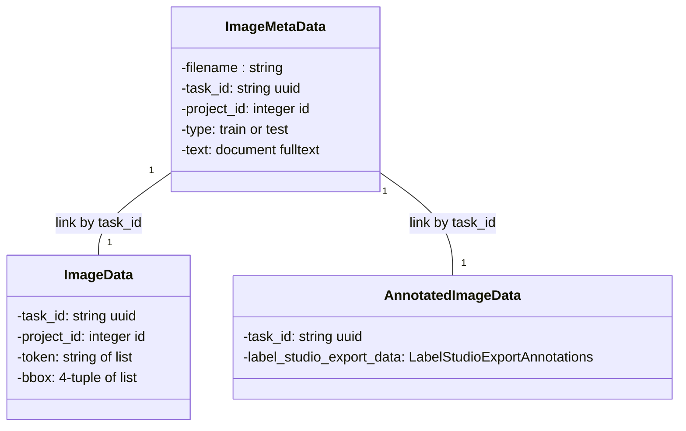

# Label Studio For LayoutLM

## Script
load data to label-studio project and load ImageMetaData, ImageData to mongodb
```
LS_QA_ENDPOINT=<LABEL_STUDIO_ENDPOINT> LS_QA_TOKEN=<LABEL_STUDIO_TOKEN> LS_QA_PII_PROJECT_ID=<LABEL_STUDIO_PROJECT> MONGODB_USERNAME=<MONGODB_USERNAME> MONGODB_PASSWORD=<MONGODB_PASSWORD> python ls_loader_ocr_data.py --mongo_host <MONGODB_HOST>   -d 2022-12-16 -f images
```
export combine datasets of label-studio annotated data and ImageData
```
MONGODB_USERNAME=<MONGODB_USERNAME> MONGODB_PASSWORD=<MONGODB_PASSWORD> LS_QA_ENDPOINT=<LABEL_STUDIO_ENDPOINT> LS_QA_TOKEN=<LABEL_STUDIO_TOKEN> LS_QA_PII_PROJECT_ID=<LABEL_STUDIO_PROJECT>  python3 ls_exporter_combine_data.py  --mongo_host <MONGODB_HOST>
```


## Flowchart



## Schema


